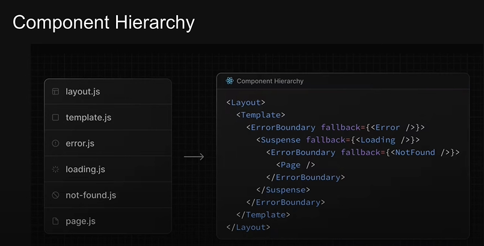

# Next.js Course by Codevolution

## Day 1

### 1. How to Make Pages
- Introduction to creating pages in Next.js.
- Examples of creating simple pages.

### 2. About Routing (Nested, Dynamic, etc.)
- Overview of routing in Next.js.
- Nested routes.
- Dynamic routes, e.g., `[productsId]`.

### 3. Custom 404 Page
- Creating a 404 error page.
- Using the `not-found.tsx` file.

### 4. Catch-All Segments
- Working with catch-all segments, e.g., `[...slug]`.
- Examples using `src/app/docs`.
- Additional examples using `src/app/profile`.

## Day 2

### 1. How to Hide Routes
- Hiding routes in Next.js. `(auth)`
- Practical examples and tips.

### 2. How to Use Layouts in Next.js
- Using layout components to create web pages.
- Examples of creating shared layouts.

### 3. Hidden Files (e.g., `_lib`)
- Organizing private folders and files.
- Examples of using folders starting with an underscore.

### 4. Metadata
- Exporting metadata using `export const metadata`.
- Examples from `src/app/layout.tsx` and `src/app/about/page.tsx`.
- Additional examples with dynamic routes, e.g., `src/app/profile/[profileId]`.

### 5. Link / Navigation in Application
- Using the `Link` component for navigation.
- Examples of adding navigation to the application.
- Performance of the `Link` component.

### 6. "use client";

## Day 3

### 1. Navigating Programmatically
- Using hooks like `useRouter` for programmatic navigation.
- Examples:
  - `router.replace("/")`: Replaces the current route with a new one.
  - `router.push("/")`: Pushes a new route onto the history stack.
  - `router.forward()`: Navigates forward in the history stack.
  - `router.back()`: Navigates backward in the history stack.
- Example: `src/app/order-product`.

### 2. Templates
- When a user navigates between routes that share a template, a new instance of the component is mounted, DOM elements are recreated, state is not preserved, and effects are re-synchronized.
- A template can be defined in `template.tsx`.
- Templates should accept a `children` prop.
- Unlike `layout.tsx`, which doesn't change when refreshed, `template.tsx` changes when refreshed.
- Example: `src/app/(auth)/(with-auth-layout)/layout.tsx` can be renamed to `template.tsx`.

### 3. Loading.tsx
- This file allows us to create loading states that are displayed to users while a specific route segment's content is loading.

### 4. Error.tsx
- In Next.js, error boundaries are used to catch and handle errors in a React component tree. They allow you to render a fallback UI when an error occurs, instead of letting the error crash the entire application.

### 5. Parallel Routes
- Improved Page Load Performance.
- Enhanced User Experience.
- Modular Development.
- Error Isolation.
- Example: `src/app/complex-dashboard`.

### 6. Unmatched Routes Default.tsx
- In Next.js, you can handle unmatched routes by using a `default.tsx` file in the appropriate parallel route folder. This acts as a fallback component for any route that doesn't match a specific route in the same segment.

## Day 4-5

### 1. Intercepting Routes
- Utilizing symbols to create special route patterns:
  - `(.)`: Current route segment.
  - `(..)`: Parent route segment.
  - `(..)(..)`: Grandparent route segment.
  - `(...)`: Root route segment.
- These symbols are useful for intercepting routes and defining relative paths dynamically.
- Example: `src/app/photo-feed`.

### 2. Route Handlers / Query Parameters
- Handling different HTTP methods in route handlers:
  - `GET`
  - `POST`
  - `PATCH`
  - `DELETE`
- Using dynamic route handlers to manage these methods efficiently.
- Example: `src/app/comments`.
- Implementing route handlers with `route.ts`.

### 3. Thunder Client
- Using Thunder Client, an extension for VS Code, for API testing and development.
- It provides a simple and efficient way to test your API endpoints directly within the code editor.

## Day 6

### 1. Cookies/Headers
- Managing cookies and headers is essential for maintaining state and handling user sessions in web applications.
- Cookies can be used to store user-specific data, such as authentication tokens, while headers are useful for passing metadata and other information between the client and server.
- Example: `src/app/profile/api` 

### 2. Caching
- Caching is a technique used to store frequently accessed data temporarily to reduce the load on the server and improve the response time for the end-user.
- Implementing caching mechanisms can significantly enhance the performance of web applications by minimizing database queries and network latency.
- Example: `src/app/time` 

### 3. Middleware
- Middleware functions are used to process requests before they reach the route handlers and can also be used to process responses before they are sent back to the client.
- Common uses of middleware include authentication, logging, error handling, and data validation.
- Middleware can be applied globally to all routes or selectively to specific routes based on the application's requirements.

## Day 7

### 1. Server Rendering Strategies

- **Static Rendering**
  - **Description**: Generates HTML at build time. This HTML is then reused for each request.
  - **Benefits**: Fast response times and reduced server load as the content is pre-built.
  - **Use Cases**: Ideal for content that doesn't change frequently, such as blogs, documentation, and marketing pages.

- **Dynamic Rendering**
  - **Description**: Generates HTML on each request. This approach allows for content that changes frequently.
  - **Benefits**: Always serves the most up-to-date content.
  - **Use Cases**: Suitable for user-specific data, dashboards, and any content that updates frequently.

- **Streaming**
  - **Description**: Streams parts of the HTML as soon as they are ready, rather than waiting for the entire page to be generated.
  - **Benefits**: Faster time to first byte (TTFB), leading to a quicker perceived load time.
  - **Use Cases**: Beneficial for large pages or pages with heavy data processing.

### 2. ThemeProvider Hook Usage

- **ThemeProvider Hook**
  - **Description**: A React component that allows you to manage and apply themes throughout your application. It provides a context to pass down theme-related properties to all components within the provider.
  - **Use Cases**: Managing themes (light/dark) and applying them across your application components.
  - Example: `src/components/theme-provider`

### Useful Links:
- [Course Videos on YouTube](https://www.youtube.com/watch?v=ZjAqacIC_3c&list=PLC3y8-rFHvwjOKd6gdf4QtV1uYNiQnruI&ab_channel=Codevolution)

---
